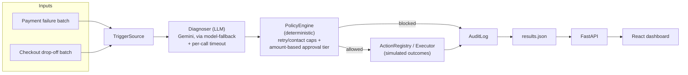
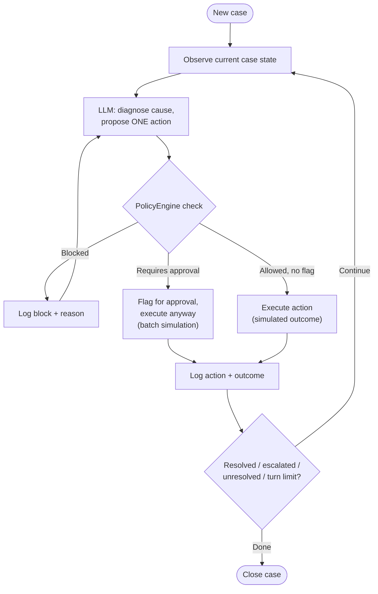
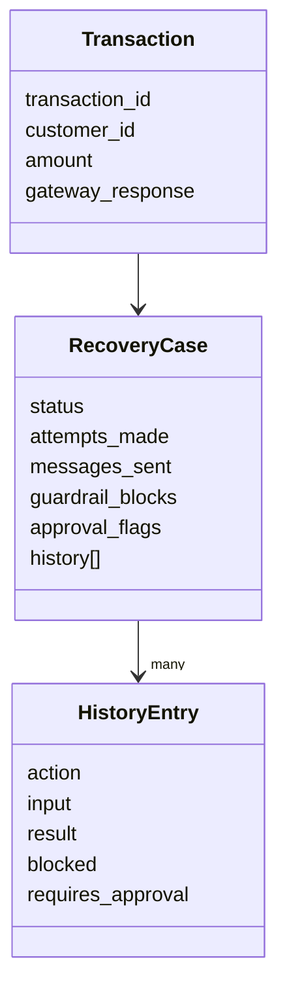

# RecoverAI — Autonomous Revenue Recovery Engine

**Razorpay Buildathon — Track 03: AI Revenue Recovery**

    

> **Disclaimer:** RecoverAI is a prototype built for the Razorpay Buildathon. It runs entirely on synthetic transaction and checkout-session data through simulated (not live) recovery actions. It does not process real payments, send real messages, or connect to any production payment gateway.

Built solo by Prachi, B.Tech ECE, IIIT Naya Raipur.

---

## Executive Summary

Failed payments and abandoned checkouts are two of the most common — and most sloppily handled — sources of revenue leakage for online businesses. Most systems either retry every failure identically regardless of cause, or push everything to manual review. Neither is precise, and both scale badly.

**RecoverAI** is an agent that diagnoses *why* a payment failed or a checkout was abandoned, and takes exactly one bounded, policy-gated action to try to recover it — retry, offer an alternate method, send a reminder, escalate, or honestly give up. It runs the same underlying engine across **two working trigger sources** (payment failure recovery and checkout drop-off), proving the architecture generalizes with working code, not a slide. Every money-adjacent decision passes through a deterministic policy layer — including an amount-based approval tier modeled on the idea that an AI agent shouldn't have blanket authority over real money — and that policy layer is proven correct by **19 passing unit tests**, independent of the LLM. On the payment-recovery batch, RecoverAI resolves **60%** of cases versus a naive "always retry once" baseline's **46%**, on the identical dataset.

---

## 1. The Business Problem

When a payment fails or a checkout is abandoned, the underlying cause varies wildly — insufficient funds, a declined card, a network blip, a bank outage, a customer who just got distracted mid-checkout — and the *right* response depends entirely on which one it is. Retrying a declined card rarely helps; retrying a network timeout often does. Messaging a customer who abandoned at the OTP step needs different handling than one who dropped off at shipping details. Most recovery systems don't make this distinction: they apply one blunt policy (retry everything, or email everything) regardless of cause, which wastes recovery attempts on cases that will never convert and misses cases that would have.

The harder problem underneath: any system that acts autonomously on payment data needs to prove it won't do something reckless — retry forever, spam a customer, or move money without appropriate oversight. Diagnosis without restraint is just a different way to cause damage.

## 2. Our Solution

RecoverAI is a pluggable recovery engine, not a single-purpose script. Two trigger sources currently run on it:

| Trigger | Watches | Status |
|---|---|---|
| **Payment failure recovery** | Failed transactions — card declines, insufficient funds, network timeouts, bank server errors, and messy/ambiguous gateway error strings | Fully built, tested, benchmarked |
| **Checkout drop-off recovery** | Abandoned checkout sessions across cart / shipping / payment-details / OTP-verification stages | Fully built, tested, benchmarked (numbers pending a fresh run — see §7) |

Both follow the identical loop: **diagnose (LLM) → propose one bounded action (LLM) → gate the action (deterministic policy) → execute (simulated outcome) → log (audit trail) → repeat until resolved, escalated, or honestly marked unresolved.**

The LLM's job is deliberately narrow: interpret a messy signal into a likely cause, and pick one action from a short, fixed list. It never decides whether that action is *allowed* to run — that's a separate, deterministic, unit-tested policy layer. The model proposes; policy decides.

## 3. Architecture

### High-level flow



### Per-case processing loop



### Data model



### Files

```
backend/
├── models.py               # Transaction, RecoveryCase (payment engine)
├── tools.py                 # Payment action registry + simulated executor
├── policy_engine.py         # Payment guardrails: retry/message caps,
│                             #   amount-based approval tier
├── prompts.py                # Payment diagnosis system prompt
├── agent.py                  # Payment engine's core loop + shared LLM
│                             #   plumbing (fallback chain, timeout, retry)
├── audit_log.py               # Shared JSON-lines audit logger
├── generate_dataset.py        # Payment batch generator
├── run_baseline.py            # Naive "always retry once" baseline
├── test_policy_engine.py      # 9 deterministic guardrail tests
├── main.py                    # Payment batch entry point -> results.json
├── api.py                     # FastAPI serving results.json to the dashboard
├── checkout_trigger.py        # Second trigger: own case model, actions,
│                             #   policy, prompt, dataset, run loop
└── test_checkout_policy.py    # 10 deterministic guardrail tests

frontend/
└── src/
    ├── App.tsx    # Stats, distribution bar, guardrail panel, approval
    │               #   tiering panel, leakage-by-category, case list,
    │               #   reasoning trail
    ├── types.ts
    ├── api.ts
    └── index.css   # Dark ledger/control-room design system
```

### Key design decisions

- **LLM vs. deterministic split.** The model diagnoses and picks from a bounded list; a separate policy layer, plain Python, decides what's actually allowed to run.
- **Every action type has a real simulated success chance**, not just one "primary" action — see §7 for why this mattered.
- **AgentVault-style approval tiering, applied per-domain.** An AI agent shouldn't have blanket authority over real money. In the payment engine, actions on transactions above ₹5,000 get flagged `requires_approval`. In the checkout engine, there's no transaction amount to gate on, so the tier keys on discount value given away (`cart_value × percent_off`), flagged above ₹300 — same idea, two honest, independently-implemented applications.
- **Model fallback chain, ordered by quota, not capability.** Lite-tier models lead the chain since flagship "-latest" aliases get a much smaller free-tier daily quota.
- **Hard per-call timeout** via a background executor, so the SDK's own internal retries can never silently stack with ours into a multi-hour hang.
- **Guardrails are proven by unit test**, not assumed from a live example — see §6.

## 4. Core Features

- Two working trigger sources on one pluggable engine (payment failures, checkout drop-off)
- Bounded action registry per domain — the model can never invent an action outside the fixed list
- Deterministic policy engine with retry caps, no-repeat-contact rules, and amount-based approval tiering
- Full audit trail: every decision, blocked or not, with the model's stated reasoning
- Naive-baseline comparison computed on the identical dataset, not asserted in isolation
- Dashboard: command-center stats, outcome distribution with baseline marker, guardrail activity panel, approval-tiering panel, revenue-leakage-by-category breakdown, filterable case list with status badges, per-case reasoning trail

## 5. User Flow

**Reviewing results (dashboard):**
1. Open the command center — total cases, ₹ at risk, ₹ recovered, resolved rate vs. baseline
2. Scan the outcome distribution bar — resolved/escalated/unresolved, with the baseline rate marked directly on it
3. Check the Guardrail activity and Approval tiering panels — see exactly which actions were blocked or flagged, and why
4. Review the revenue-leakage-by-category table — which failure causes recover well, which don't, and whether that matches expectations (it should: causes worth retrying resolve high, causes that don't respond to retries resolve lower)
5. Filter the case list by status, click into any case, and read its full reasoning trail — what the agent saw, concluded, tried, and why

**Running a batch (operator):**
1. `python generate_dataset.py` — produce a fresh synthetic batch
2. `python main.py` (payment) or `python checkout_trigger.py` (checkout) — process the batch, print a summary, write `results.json`
3. `uvicorn api:app --reload` — serve the results
4. `npm run dev` (in `frontend/`) — view the dashboard against the live API

## 6. Testing & Demo Results

### Guardrails are tested, not assumed

```
$ python test_policy_engine.py
9/9 guardrail tests passed

$ python test_checkout_policy.py
10/10 checkout guardrail tests passed
```

Covers: retry/reminder caps at and below the limit, no-repeat-contact rules, escalation never being blockable, and the approval-tiering boundary in both engines — including the exact-threshold edge case, and confirming non-money-moving actions are never flagged regardless of size.

### Payment failure recovery — 70 cases

| Metric | Value |
|---|---|
| Resolved | 42 (60%) |
| Escalated | 9 (13%) |
| Unresolved | 19 (27%) |
| Guardrail blocks | 0 (proven correct by unit test; never fired live yet) |
| Approval flags | 20 actions across 19 cases (amount > ₹5,000) |
| ₹ at risk | ₹2,66,150.86 |
| ₹ recovered | ₹1,61,185.17 (61%) |
| **Naive retry-only baseline** | **31.9/70 (46%)** |
| **RecoverAI vs. baseline** | **+14 points** |

**Leakage by root cause:**

| Category | Cases | Resolved | ₹ at risk | ₹ recovered |
|---|---|---|---|---|
| insufficient_funds | 18 | 5 (28%) | ₹75,517 | ₹23,696 |
| network_timeout | 20 | 15 (75%) | ₹56,202 | ₹45,112 |
| bank_server_error | 13 | 13 (100%) | ₹51,135 | ₹51,135 |
| card_declined | 11 | 6 (55%) | ₹46,950 | ₹29,767 |
| ambiguous_error | 8 | 3 (38%) | ₹36,347 | ₹11,475 |

Causes where persistence genuinely helps (bank server errors, network timeouts) resolve at 75–100%. Causes where retrying rarely helps (insufficient funds, card declines) resolve lower — that's the policy behaving correctly, not a weakness.

### Checkout drop-off recovery — 40 cases (pre-fix run, see §7)

| Metric | Value |
|---|---|
| Resolved | 10 (25%) |
| Escalated | 6 (15%) |
| Unresolved | 24 (60%) |
| ₹ cart value at risk | ₹1,25,288.73 |
| ₹ cart value recovered | ₹28,444.29 (23%) |
| Approval flags | 9 (discount value > ₹300) |
| Naive "always send one reminder" baseline | 8.8/40 (22%) |

These numbers predate the closure-logic fix in §7 — most of the 60% unresolved figure was a labeling bug, not a real ceiling. Kept here deliberately rather than deleted: the before/after is a more honest story than a single clean number.

## 7. What Broke (and what we did about it)

Four real incidents from across this build, in the order they surfaced:

**1. The agent was structurally losing to a naive baseline.** Early on, only the `retry_payment` action could ever mark a case resolved in the simulation — `offer_alt_method` and `send_recovery_message` executed and logged normally but had no simulated success path. So every time the agent correctly avoided a low-odds retry in favor of a smarter action, the test harness was guaranteed to score it as a loss. Resolved rate was 31%, against a dumb "always retry once" baseline's 43%. The bug wasn't in the agent's reasoning — it was in how the evaluation measured it. Fix: gave every action type a real, independent simulated success probability. Resolved rate rose to the 56–67% range and has beaten the baseline in every run since.

**2. The free-tier quota is per model, per day — not per project.** Running a 70-case payment batch and a 40-case checkout batch the same day burns through 150–300+ LLM calls against a 20-requests/day/model ceiling. Result: a wall of `429 RESOURCE_EXHAUSTED` errors and a batch that was 80% errored cases. Fix: run small batches (10–15 cases) during iteration, and only pull the final numbers right after a quota reset.

**3. A model in the fallback chain was silently deprecated mid-build — twice.** `gemini-2.5-flash` and later `gemini-2.5-flash-lite` each stopped being available to new API keys without warning; the API's own error message named the exact replacement each time. While investigating the second occurrence, discovered that two entries in the fallback chain — both `-latest` aliases — currently resolve to the *same* underlying model for quota purposes, meaning a "3-model" fallback chain was really only 2 independent quota pools. Fixed by pinning a genuinely distinct model in the middle of the chain.

**4. Most "unresolved" checkout cases weren't actually failing — they were mislabeled.** After fixing #2 and #3, the checkout trigger still only resolved 25% of cases, with 60% marked unresolved and the audit log claiming `"reason": "max_iterations_reached"` on nearly all of them. Tracing one case end to end showed it had taken exactly one action — turn 1 of a 5-turn budget — and closed immediately. The logging was lying: the closure code labeled *every* early exit "max_iterations_reached" regardless of which turn it actually happened on. Once the logging was fixed to distinguish the two cases, the real behavior became clear: the model was treating a failed SMS reminder as "sent, let's wait and see" — reasonable real-world intuition, wrong for a synchronous batch simulation where every outcome is already final. Fixed the prompt to state explicitly that outcomes are immediate within the simulation. Re-verification run is pending (§9).

**The throughline:** none of these were "the AI made a bad call." Each one was an infrastructure or visibility problem that made it hard to see what the AI was actually doing — and fixing the visibility is what surfaced the real, fixable cause underneath.

## 8. Future Improvements & Known Limitations

- **Extensibility beyond the two built triggers.** The TriggerSource / Diagnoser / PolicyEngine / ActionRegistry pattern is designed to generalize — B2B receivables chasing and mandate-retry sequencing would extend it directly, and are documented as roadmap items rather than built shallowly. Promise-to-pay tracking needs a genuinely different (asynchronous, scheduled) execution model, not just a new trigger, and Hinglish voice recovery needs real telephony or a clearly-labeled text simulation — both deliberately out of scope for this build.
- **Guardrail *blocks* (as opposed to approval *flags*) haven't fired in a live batch yet on either engine.** Correctness is proven by unit test instead, which is arguably stronger evidence since it doesn't depend on a particular random batch happening to trigger the limit.
- **No live human-in-the-loop UI for approval flags yet.** In this batch simulation, flagged actions still execute; the flag documents what would require sign-off in production, it doesn't gate it yet.
- **Checkout trigger's corrected numbers are pending a clean re-run** after the closure-logic fix in §7.
- Synthetic data could be explicitly calibrated against a cited real industry benchmark for failure-cause distribution, strengthening realism without needing a mismatched external ML dataset.

## 9. Immediate Next Steps

- [ ] Clean re-run of `checkout_trigger.py` post-fix, update §6's checkout table with real numbers
- [ ] Confirm both `.env` files are git-ignored before pushing the public repo
- [ ] Record the 5-minute pitch video against these exact final numbers